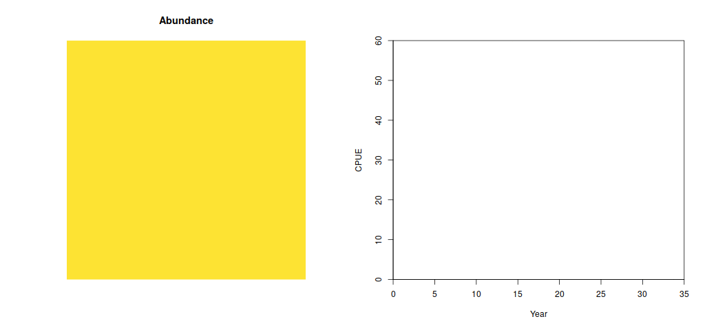
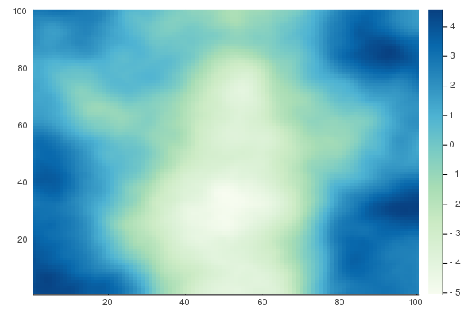
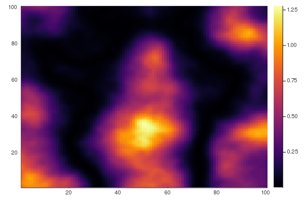
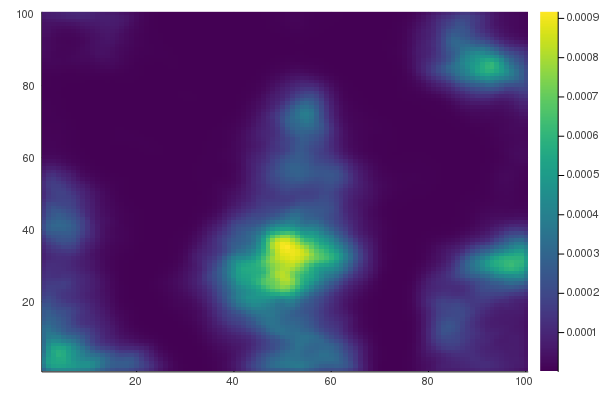
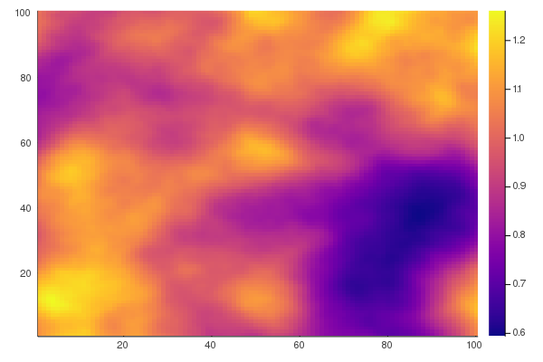
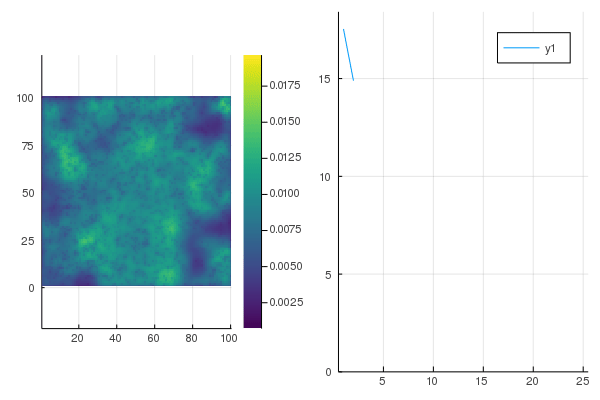

$\renewcommand{\vec}[1]{\boldsymbol{#1}}$
```{r include=FALSE}
knitr::opts_chunk$set(echo = FALSE,
                      fig.align = "center")
```
---

# Standardizing CPUE

## **Goal:** An index of abundance that is *proportional* to true abundance

---

# Model-based (GLM) methods

In the simplest version, a GLM with

- link function $g$,
- catch observations $\vec{c}$,
- abundance design matrix $\vec{X}$, and
- catchability design matrix $\vec{R}$,

giving the linear predictor

$$g(\vec{C}) = \vec{X}\vec{\beta} + \vec{R}\vec{\gamma}.$$

The vector of estimated abundance effects $\hat{\vec{\beta}}$ with an index design matrix $\vec{X}^*$ can be used to estimate relative abundances $\vec{I}$:

$$g(\vec{I}) = \vec{X}^* \hat{\vec{\beta}}.$$

???

- Most common link function: $\log$
- $\vec{X}$ includes at least years as covariates
- $\vec{R}$ includes at least vessel as covariates; $\vec{\gamma}$ accounts for different catchabilities among vessels

---

# Spatiotemporal standardization

Both abundance and effort can vary in space and time.

```{r cache=TRUE, include=FALSE}
pop <- matrix(1, nrow = 100, ncol = 100)
fish_idx <- function(t) matrix(1:10000 <= (500 * t), nrow = 100, ncol = 100)
fish <- function(popstate) {
  popstate$t <- popstate$t + 1
  idx <- fish_idx(popstate$t)
  catch <- 0.2 * popstate$pop * matrix(idx, ncol = 100, nrow = 100)
  pop <- popstate$pop - catch
  list(t = popstate$t, pop = pop, catch = c(popstate$catch, sum(catch)))
}

fish2 <- function() {
  popstate <- list(t = 0, pop = pop, catch = 0)
  while (popstate$t <= 30) {
    par(mfrow = c(1, 2))
    image(popstate$pop, asp = 1, col = hcl.colors(n = 20),
          axes = 0, zlim = c(0, 1),
          main = "Abundance")
    plot(0:popstate$t, popstate$catch / sapply(0:popstate$t, function(t) log(sum(fish_idx(t)))),
         type = 'l',
         xlim = c(0, 35), xaxs = "i", xlab = "Year",
         yaxs = "i", ylim = c(0, 60), ylab = "CPUE")
    popstate <- fish(popstate)
  }
}
saveGIF(fish2(), movie.name = "hyperstable.gif",
        interval = 0.4, ani.width = 1024)
```

```{r echo=FALSE}

```

???

Implicit assumptions of GLM model:
- All catches exchangeable
- Observed catches representative of entire domain

---

# Data

## Fishery-independent data

Currently used in spatiotemporal standardization models

- Sampling procedures standardized
- Predetermined locations

## Fishery-dependent data

- Ad-hoc procedures
- Preferentially target areas of high abundance/catchability

---

# Estimation model

## Observation likelihood

For the $i$th observed catch $c_i$ with probability of encounter $p_i$ and positive catch rates $r_i$,

$$c_i \sim \begin{cases}
    \operatorname{Bernoulli}(1 - p_i) & \text{if } c_i = 0\\
    \operatorname{Bernoulli}(p_i) \times \operatorname{log Normal}\left(r_i - \frac{\sigma^2}{2}, \sigma^2\right) & \text{if } c_i > 0
\end{cases}$$

---

# Estimation model

## Link function

Probability of encounter and positive catch rate is derived from numbers density $n_i$ and weight per group $w_i$ using the Poisson link (area swept $a_i$ can be included as an offset),

$$\begin{aligned}
p_i &= 1 - \exp(-a_i n_i)\\
r_i &= \frac{n_i}{p_i}w_i.
\end{aligned}$$

---

# Estimation model

## Linear predictors

Numbers density and weight per group are modeled using a linear predictor with some or all of the abundance components

- $\vec{X}_\cdot\vec{\beta}_\cdot$ Fixed effects and covariates
- $\vec{Z}_\cdot\vec{\gamma}_\cdot$ General random effects and covariates
- $\vec{A}_\omega\vec{\omega}_\cdot$ Spatial process and projection matrix
- $\vec{A}_\epsilon\vec{\epsilon}_\cdot$ Spatiotemporal process and projection matrix

The catchability model similarly may include

- $\vec{R}_\cdot\vec{\lambda}_\cdot$ Fixed effects and covariates
- $\vec{V}_\cdot\vec{\eta}_\cdot$ General random effects and covariates
- $\vec{A}_\phi\vec{\phi}_\cdot$ Spatial process and projection matrix
- $\vec{A}_\psi\vec{\psi}_\cdot$ Spatiotemporal process and projection matrix

---

# Estimation model

## Linear predictors

These give the linear predictors for numbers density and weight per group (collected as vectors)

$$\begin{aligned}
\log(\vec{n}) &=
\vec{X}_n        \vec{\beta}_n +
\vec{Z}_n        \vec{\gamma}_n +
\vec{A}_\omega   \vec{\omega}_n +
\vec{A}_\epsilon \vec{\epsilon}_n +
\vec{Q}_n        \vec{\lambda}_n +
\vec{V}          \vec{\eta}_n +
\vec{A}_\phi     \vec{\phi}_n +
\vec{A}_\psi     \vec{\psi}_n\\
\log(\vec{w}) &=
\vec{X}_w        \vec{\beta}_w +
\vec{Z}_w        \vec{\gamma}_w +
\vec{A}_\omega   \vec{\omega}_w +
\vec{A}_\epsilon \vec{\epsilon}_w +
\vec{Q}_w        \vec{\lambda}_w +
\vec{V}          \vec{\eta}_w +
\vec{A}_\phi     \vec{\phi}_w +
\vec{A}_\psi     \vec{\psi}_w.
\end{aligned}$$

---

# Estimation model

## Spatial processes


```{r include=FALSE}
loc <- matrix(runif(2000), ncol = 2)
mesh <- INLA::inla.mesh.2d(loc, offset = c(0.05, 0.2), min.angle = c(30, 21), max.edge = c(0.1, 0.2), cutoff = 5e-2)
spde <- INLA::inla.spde2.matern(mesh, parameters = c(0.4, 1.0))
Q <- INLA::inla.spde.precision(spde, c(1 / 0.5, 1.0))
```

```{r echo=FALSE}
plot(mesh)
```
???

Spatial precision matrices are constructed using the SPDE method (Lindgren
2011). Spatiotemporal precision matrices use the same construction but include a
separable temporal component.

---

# Estimation model

## Spatial processes

```{r echo=FALSE}
Matrix::image(Q)
```

???

Spatial precision matrices are constructed using the SPDE method (Lindgren
2011). Spatiotemporal precision matrices use the same construction but include a
separable temporal component.

---

# Estimation model

## Index of abundance

For a set of integration locations $\vec{s}^*$ associated with integration
weights $h(\vec{s}^*)$, the design matrices $\vec{X}^*$ and $\vec{Z}^*$ can be
constructed with one row per location and time. The projection matrices
$\vec{A}_\omega^*$ and $\vec{A}_\epsilon^*$ can be constructed similarly. Then
given estimates of the abundance parameters $\hat{\vec{\beta}}_\cdot$,
$\hat{\vec{\gamma}}_\cdot$, $\hat{\vec{\omega}}_\cdot$, and
$\hat{\vec{\epsilon}}_\cdot$ the linear predictors can be evaluated

$$\log(\vec{n}^*) =
\vec{X}^*_n        \hat{\vec{\beta}}_n +
\vec{Z}^*_n        \hat{\vec{\gamma}}_n +
\vec{A}^*_\omega   \hat{\vec{\omega}}_n +
\vec{A}^*_\epsilon \hat{\vec{\epsilon}}_n$$
$$\log(\vec{w}^*) =
\vec{X}^*_w        \hat{\vec{\beta}}_w +
\vec{Z}^*_w        \hat{\vec{\gamma}}_w +
\vec{A}^*_\omega   \hat{\vec{\omega}}_w +
\vec{A}^*_\epsilon \hat{\vec{\epsilon}}_w$$

---

# Estimation model

## Index of abundance

Using the linear predictors, the value of the index at time $t$ is

$$\hat{b}_t = \sum_{\vec{s^*}} h(\vec{s}^*) n^*_t(\vec{s}^*) w^*_t(\vec{s}^*)$$

---

# Operating model

## Preparation

- 100×100 gridded domain

Abundance:

- Habitats generated from Gaussian random field
- Movement based on habitat preference
- Initial population at equilibrium spatial distribution
- Schaefer population dynamics

Fishery:

- Targeting behavior
- Catchability

---

# Operating model

## Habitat

```{r}

```

---

# Operating model

## Habitat preference

```{r}

```

---

# Operating model

## Equilibrium spatial distribution

```{r}

```

---

# Operating model

## Simulation

Three phases:

1. Fish
2. Produce
3. Move

---

# Operating model

## Fishing

Two vessels:

1. Survey
2. Commercial

Differ by:

- Targeting
- Catchability

???

Survey has fixed station locations
Fishery has preference for high-abundance areas

Catchability is what varies here!
- Fixed or varying in space
- Spatial variation generated as deviations (log-normal with mean 1)

---

# Operating model

## Catchability deviations

```{r}

```

???

Mean one

---

# Operating model

## Catch

Generated from compound Poisson gamma distribution for each fishing event:

- $\mu_i > 0$ Product of abundance and catchability at time and location of event $i$
- $1 < p < 2$ Shape parameter; controls proportion nonencounters and variance-mean relationship
- $v > 0$ Variance parameter

$$\begin{aligned}
g_i &\sim \operatorname{Poisson}\left(\frac{\mu_i^{2-p}}{v(2-p)}\right)\\
c_i \mid g_i &\sim \operatorname{Gamma}\left(G \times \frac{2-p}{p-1}, v(p-1)\mu_i^{p-1}\right)
\end{aligned}$$

???

Approximated by Poisson-link proces in estimation model

---

# Operating model

## Probability of nonencounter

Encounter/nonencounter probability changes with abundance and catchability through $\mu$

$$\Pr(c_i = 0) = \exp\left(-\frac{\mu^{2-p}}{v(2-p)}\right)$$

---

# Operating model

## Production

Cell-wise Schaefer with region-wide carrying capacity. For post-fishing biomass at location $\vec{s}$ $B_t^{*}(\vec{s})$, the post-production biomass $B_t^{**}$ is

$$B_t^{**}(\vec{s}) = B_t^*(\vec{s}) + rB_t^*(\vec{s}) \left(1 - \frac{\sum_\vec{s} B_t^*(\vec{s})}{K}\right)$$

---

# Operating model

## Example

```{r echo=FALSE}

```

---

# Simulation study

## Catchability scenarios

1. **Naive**: no spatially varying catchability
2. **Simple**: fishery-dependent subject to spatially varying catchability
3. **Scaled**: both subject, but deviations 1/2 as far from one for -independent
4. **Shared**: both subject to identical spatially varying catchability

Scaling: for catchability $q_t(\vec{s})$, the scaled catchability $\tilde{q}_t(\vec{s})$ is

$$\tilde{q}_t(\vec{s}) = q_t(\vec{s}) - \frac{q_t(\vec{s}) - 1}{2}$$

---

# Simulation study

## Population trends

1. **Declining**: Steady effort reduces population to a depletion of 20% in 25 years
2. **Steady**: Population is in equilibrium with fishing efforts
3. **Round-trip**: Population quickly reduced to 20% depletion, allowed to partially recover

???

Questions:

- Different bias depending on trend?
- How does different amounts of information change estimation?

---

# Simulation study

## Estimation models

- Use *only* fishery-independent observations (current baseline)
- Use both data types
- Use both data types, but only a constant-sized subset of the fisher-dependent observations

???

Subset fits look to look at the differences between changing effort and changing numbers of observations

---

# Simulation study

## Do these capture enough realistic variation?

## Am I missing important dynamics?

---

# Comparing results

Desirable properties of an index of abundance are

- unbiased
- low error
- well-calibrated uncertainty

---

# Simulation study

## Bias

For scenario $s$ (catchability, population trend) for replicate $r$ in year
$t$ with estimation model $e$, a regression model is fit

$$\log b_{srt} = \alpha_{sre} + \delta_{se} \log b_{set} + \varepsilon_{sret}$$
$$\varepsilon_{sret} \sim \operatorname{Normal}(0, \sigma^2_{se})$$

An unbiased model will result in a fit with $\delta_{se} = 1$.

---

# Simulation study

## Error

Root mean square error will be used to evaluate total 

Comparisons are done between indices (true and estimated) transformed to a
matching scale so that the scaled index in year $t$, $\tilde{b}_t$, is based on
the true $b_t^*$ or estimated index $b_t$,

$$\tilde{b}_t = \frac{b_t}{\exp\left(\frac{1}{n}\sum_t \log b_t\right)}$$

Then RMSE is then

$$RMSE_{se} = \sqrt{\frac{1}{R}\frac{1}{T}\sum_r \sum_t \left(\tilde{b}_t - b_t^*\right)^2}

---

# Simulation study

## Coverage

Histograms of normal quantiles of the true values relative to the estimated
values and uncertainties of the estimates will be used to examine calibration.

```{r fig.height = 4, fig.width = 9, dpi = 300}
par(mfrow = c(1, 3))
x <- seq(0, 1, length.out = 1025)
plot(x, dbeta(x, 0.9, 0.9), type = 'l', ylim = c(0, 1.5),
     main = "Estimated uncertainty low", xlab = "Quantile", ylab = "")
plot(x, dbeta(x, 1, 1), type = 'l', ylim = c(0, 1.5),
     main = "Estimated uncertainty correct", xlab = "Quantile", ylab = "")
plot(x, dbeta(x, 1.5, 1.5), type = 'l', ylim = c(0, 1.5),
     main = "Estimated uncertainty high", xlab = "Quantile", ylab = "")

```
