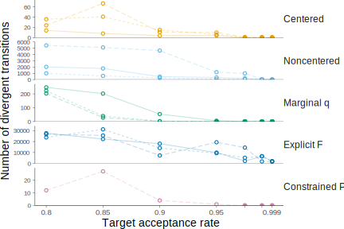
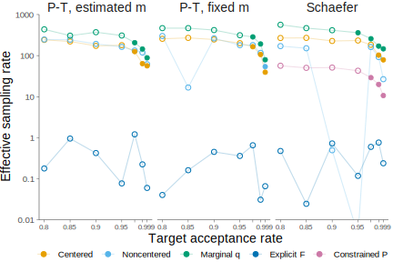
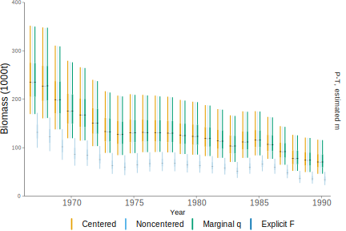
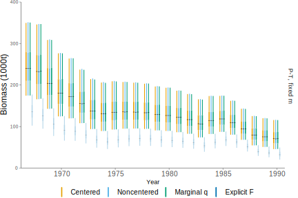
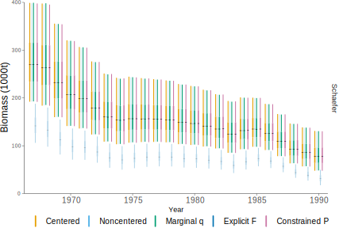
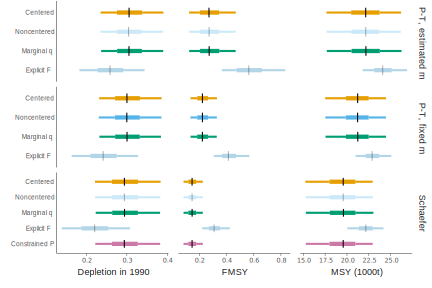
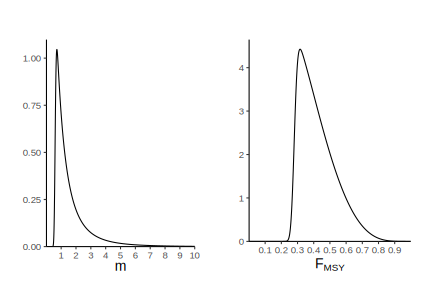
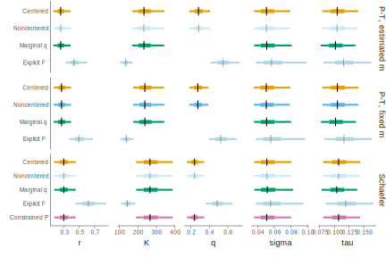
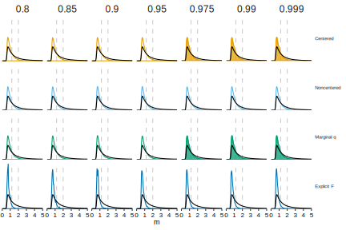

<!--
Colors:
Posterior:
- full: #3b99b1
- fade: #9dccd8
Observation likelihood:
- full: #7f9977
- fade: #cfdfca
Latent likelihood:
- full: #e8a419
- fade: #f3d18c
Prior:
- full: #f5191c
- fade: #fa8c8d
-->

$\renewcommand{\vec}[1]{\boldsymbol{#1}}$
$\DeclareMathOperator{\logNormal}{log Normal}$
$\DeclareMathOperator{\Normal}{Normal}$
$\DeclareMathOperator{\InvGamma}{Inverse Gamma}$
$\DeclareMathOperator{\Exponential}{Exponential}$

```{r setup, echo=FALSE}
knitr::opts_chunk$set(dpi = 300,
                      echo = FALSE,
                      fig.align = "center",
                      fig.height = 8,
                      fig.width = 12)

library(tidyverse)
library(gridExtra)

theme_jkb <- function(base_size = 20,
                      ## title_family = "Arial",
                      ## base_family = "Arial") {
                      title_family = "Droid Serif",
                      base_family = "Droid Serif") {
  sizes <- c(8, 9, 10, 11, 12, 14, 16, 18, 20, 24, 28, 32)
  base_idx <- which(base_size == sizes)
  theme(
    text = element_text(family = base_family,
                        size = base_size),
    plot.margin = unit(c(0.5, 0.75, 0.5, 0.25), "cm"),
    ## Title
    title = element_text(family = title_family,
                         size = sizes[base_idx + 3]),
    ## Panel
    panel.background = element_blank(),
    panel.grid = element_blank(),
    ## Axes
    axis.line = element_line(),
    axis.title = element_text(family = title_family,
                              size = sizes[base_idx + 1]),
    axis.text = element_text(),
    ## Facet labels
    strip.text = element_text(size = sizes[base_idx + 1]),
    strip.background = element_blank(),
    ## Legend labels
    legend.title = element_text(family = title_family,
                                size = sizes[base_idx + 1]),
    legend.text = element_text(),
    legend.key = element_blank())
}
```

---

# Surplus production models

```{r echo=FALSE}
pt_prod <- function(b, r = 0.1, K = 1, m = 2) {
  r / (m - 1) * b * (1 - (b / K)^(m - 1))
}

prod_df <- expand.grid(m = c(1.188115, 2, 3.39),
                       b = seq(0, 1, length.out = 257)) %>%
  mutate(prod = map2_dbl(m, b, ~ pt_prod(.y, m = .x)))
ggplot(prod_df, aes(x = b, y = prod, group = m)) +
  geom_line() +
  labs(x = "B / K", y = "Surplus Production") +
  theme_jkb(12) +
  scale_x_continuous(expand = expand_scale()) +
  scale_y_continuous(expand = expand_scale())
```

---

# The posterior is the goal

## $$\color{#3B99B1}{[\vec{\theta}, \vec{P} \mid \vec{I}]} \propto \color{#7F9977}{[\vec{I} \mid \vec{P}, \vec{\theta}]} \color{#E8A419}{[\vec{P} \mid \vec{\theta}]} \color{#F5191C}{[\vec{\theta}]}$$

.pull-left[
## Components

- $\vec{I}$: CPUE
- $\vec{P}$: Population state
- $\vec{\theta}$: Parameters
]

--

.pull-right[
## Models

- $\color{#3B99B1}{[\vec{\theta}, \vec{P} \mid \vec{I}]}$: Posterior
- $\color{#7F9977}{[\vec{I} \mid \vec{P}, \vec{\theta}]}$: Observation
- $\color{#E8A419}{[\vec{P} \mid \vec{\theta}]}$: State
- $\color{#F5191C}{[\vec{\theta}]}$: Priors
]

---

# MCMC is the tool

```{r}
Sig <- function(x, y) {
  ## sigx <- exp(x / 2)
  ## sigy <- exp(-y / 2)
  sigx <- 1
  sigy <- 1
  rho <- 0.9
  matrix(c(sigx, rho, rho, sigy), nrow = 2)
}

dens <- function(x, y) exp(-t(c(x, y)) %*% solve(Sig(x, y)) %*% c(x, y))

x <- seq(-2, 2, length.out = 101)
post_dens <- outer(x, x, Vectorize(dens))

dplot <- filled.contour(x = x, y = x, z = post_dens,
                        color.palette = function(n) hcl.colors(n, "viridis"))
dplot
```

---


# Model - Observation likelihood

$$\color{#7f9977}{I_t \sim \logNormal(qKP_t, \tau^2)}$$

$$\color{#f3d18c}{\tilde{P}_t = P_{t-1} + \frac{r}{m - 1} P_{t-1}(1 - P_{t-1}^{m-1}) -
  \frac{C_{t-1}}{K}}$$

$$\color{#f3d18c}{P_1 \sim \logNormal\left(\log(1), \sigma^2\right)}$$

$$\color{#f3d18c}{P_t \sim \logNormal\left(\log(\tilde{P}_t), \sigma^2\right)}$$

???

- Priors match Meyer & Millar (1999)
- How to deal with negative biomass predictions?
- How to minimize divergences and max treedepth warnings?
- How to increase sampler efficiency?

---

# Model - Latent dynamics

$$\color{#cfdfca}{I_t \sim \logNormal(qKP_t, \tau^2)}$$

$$\color{#e8a419}{\tilde{P}_t = P_{t-1} + \frac{r}{m - 1} P_{t-1}(1 - P_{t-1}^{m-1}) -
  \frac{C_{t-1}}{K}}$$

$$\color{#f3d18c}{P_1 \sim \logNormal\left(\log(1), \sigma^2\right)}$$

$$\color{#f3d18c}{P_t \sim \logNormal\left(\log(\tilde{P}_t), \sigma^2\right)}$$

???

- Priors match `r Citet(bib, "Meyer1999")`
- Used with and without truncations
- How to deal with negative biomass predictions?
- How to minimize divergences and max treedepth warnings?
- How to increase sampler efficiency?

---

# Model - Initial population 


$$\color{#cfdfca}{I_t \sim \logNormal(qKP_t, \tau^2)}$$

$$\color{#f3d18C}{\tilde{P}_t = P_{t-1} + \frac{r}{m - 1} P_{t-1}(1 - P_{t-1}^{m-1}) -
  \frac{C_{t-1}}{K}}$$

$$\color{#e8a419}{P_1 \sim \logNormal\left(\log(1), \sigma^2\right)}$$

$$\color{#f3d18c}{P_t \sim \logNormal\left(\log(\tilde{P}_t), \sigma^2\right)}$$

???

- Priors match `r Citet(bib, "Meyer1999")`
- Used with and without truncations
- How to deal with negative biomass predictions?
- How to minimize divergences and max treedepth warnings?
- How to increase sampler efficiency?

---

# Model - Population likelihood


$$\color{#cfdfca}{I_t \sim \logNormal(qKP_t, \tau^2)}$$

$$\color{#f3d18C}{\tilde{P}_t = P_{t-1} + \frac{r}{m - 1} P_{t-1}(1 - P_{t-1}^{m-1}) -
  \frac{C_{t-1}}{K}}$$

$$\color{#f3d18c}{P_1 \sim \logNormal\left(\log(1), \sigma^2\right)}$$

$$\color{#e8a419}{P_t \sim \logNormal\left(\log(\tilde{P}_t), \sigma^2\right)}$$

???

- Priors match `r Citet(bib, "Meyer1999")`
- Used with and without truncations
- How to deal with negative biomass predictions?
- How to minimize divergences and max treedepth warnings?
- How to increase sampler efficiency?

---

# Priors

$$\color{#f5191c}{r \sim \logNormal\left(-1.38, 0.51^2\right)}$$

$$\color{#f5191c}{K \sim \logNormal\left(5.04, 0.5162^2\right)}$$

$$\color{#f5191c}{p(q) \propto \frac{1}{q}}$$

$$\color{#f5191c}{\sigma^2 \sim \InvGamma\left(3.79, 0.0102\right)}$$

$$\color{#f5191c}{\tau^2 \sim \InvGamma\left(1.71, 0.0086\right)}$$

???

- From Meyer and Millar (1999)

---

# Parameterizations

|                       | Proc. err.    | $\vec{P} > 0$    | Marg. $q$     | Schaefer      |
| :-------------------  | :-----------: | :------------:   | :-----------: | :-----------: |
| Centered              | C             | Lower bound      |               |               |
| Noncentered           | **NC**        | Lower bound      |               |               |
| Marginal $q$          | C             | Lower bound      | **×**         |               |
| Explicit $F$          | C             | **Explicit $F$** |               |               |
| Constrained $\vec{P}$ | C             | **Dyn. bounds**  |               | **×**         |

---

# Catch of South Atlantic Albacore

```{r tuna_data}
# data: catches, CPUE Index, and number of years
tuna_df <- tibble(year = 1967:1989,
                  catch = c(15.9, 25.7, 28.5, 23.7, 25.0, 33.3, 28.2, 19.7,
                            17.5, 19.3, 21.6, 23.1, 22.5, 22.5, 23.6, 29.1,
                            14.4, 13.2, 28.4, 34.6, 37.5, 25.9, 25.3),
                  index = c(61.89, 78.98, 55.59, 44.61, 56.89, 38.27, 33.84,
                            36.13, 41.95, 36.63, 36.33, 38.82, 34.32, 37.64,
                            34.01, 32.16, 26.88, 36.61, 30.07, 30.75, 23.36,
                            22.36, 21.91))
```

```{r tuna_catch_plot}
catch_plot <- ggplot(tuna_df, aes(x = year, y = catch)) +
  geom_line(size = 2) +
  labs(#x = "Year",
       x = "",
       y = "Catch biomass") +
  theme_jkb()
cpue_plot <- ggplot(tuna_df, aes(x = year, y = index)) +
  geom_line(size = 2) +
  labs(#x = "Year",
       x = "",
       y = "CPUE") +
  theme_jkb()
grid.arrange(catch_plot, cpue_plot, nrow = 2L)
```

---

# Parameterization affects diagnostics

```{r}

```

???

- Solid: Pella-Tomlinson, estimated $m$
- Short dash: Pella-Tomlinson, $P_{MSY} = 0.4$
- Long dash: Schaefer

---

# Parameterization affects efficiency

```{r}

```

---

# Posteriors (mostly) don't change

```{r}

```

---

# Posteriors (mostly) don't change

```{r}

```

---

# Posteriors (mostly) don't change

```{r}

```

---

# Posteriors (mostly) don't change

```{r}

```

---

# Chapter 4 conclusions

- Parameterizations matter
- Careful tuning of modern MCMC samplers yields improved performance
- Diagnostics matter
- Marginalization of parameters improves performance

---

# Thank you!

- Jim Thorson
- Rick Methot
- Punt Lab
- QERM
- SAFS
- GSS organizers

---

# Centered parameterization

$$\color{#cfdfca}{I_t \sim \logNormal(qKP_t, \tau^2)}$$

$$\color{#e8a419}{\tilde{P}_t = \max\begin{cases}
    P_{t-1} + \frac{r}{m-1} P_{t-1}(1 - P_{t-1}^{m-1}) - \frac{C_{t-1}}{K}\\
    0.001
    \end{cases}}$$

$$\color{#f3d18c}{P_1 \sim \logNormal\left(\log(1), \sigma^2\right)}$$

$$\color{#f3d18c}{P_t \sim \logNormal\left(\log(\tilde{P}_t), \sigma^2\right)}$$

???

- "Standard" parameterization, used in Meyer & Millar 1999, Winker et al. 2018
  among others.
- Need to keep depletion positive.

---

# Noncentered parameterization

$$\color{#cfdfca}{I_t \sim \logNormal(qKP_t, \tau^2)}$$

$$\color{#e8a419}{\tilde{P}_t = \max\begin{cases}
    \left[P_{t-1} + \frac{r}{m-1} P_{t-1}(1 - P_{t-1}^{m-1}) - \frac{C_{t-1}}{K}\right]\\
    \quad\quad\quad\quad\quad\quad\quad\quad\quad\quad\quad\quad\times \exp(\sigma u_t)\\
    0.001
    \end{cases}}$$

$$\color{#e8a419}{\tilde{P}_1 = \exp(\sigma u_1)}$$

$$\color{#e8a419}{u_t \sim \Normal(0, 1)}$$

???

- Decorrelates process variance from state; common stragegy in linear latent
  Gaussian models

---

# Marginalized catchability

$$\color{#7f9977}{Z_t = \log\left( \frac{I_t}{P_tK} \right)}$$

$$\color{#7f9977}{\hat{q}' = \frac{\sum_t Z_t}{T}}$$

$$\color{#7f9977}{Z_t \sim \Normal\left( \hat{q}', \tau^2 \right)}$$

$$\color{#f3d18c}{\tilde{P}_t = \max\begin{cases}
    P_{t-1} + \frac{r}{m-1} P_{t-1}(1 - P_{t-1}^{m-1}) - \frac{C_{t-1}}{K}\\
    0.001
    \end{cases}}$$

???

- Uses *centered* dynamics
- From Walters & Ludwig (1994)

---

# Explicit fishing mortality

$$\color{#e8a419}{\tilde{P}_t =
    \left[P_{t-1} + \frac{r}{m-1} P_{t-1}(1 - P_{t-1}^{m-1}) - \frac{C_{t-1}}{K}\right]\\
    \quad\quad\quad\quad\quad\quad\quad\quad\quad\quad\quad\quad\times (1 - \exp(F_t))}$$

$$\color{#e8a419}{C_t^* = K\left[P_t + \frac{r}{m-1}P_t(1 - P_{t-1}^{m-1})\right]\exp(F_t)}$$

$$\color{#e8a419}{C_t \sim \logNormal\left(\log C_t^*, \xi^2\right)}$$

---

# Explicit fishing mortality

$$\color{#f5191c}{\xi^2 = \log\left[(\xi^*)^2 + 1\right]}$$

$$\color{#f5191c}{\xi^* \sim \Exponential(46)}$$

$$\color{#f5191c}{-F_t \sim \Exponential(1)}$$

???

- Prior on $\xi^*$ is based on 5% probability that CV is greater than 0.05
- Prior on $F_t$ places flat prior on fraction removed each year

---

# Constrained depletion

$$\color{#e8a419}{P_1 \sim \logNormal\left(\log(1), \sigma^2\right)}$$

$$\color{#e8a419}{P_t \sim \logNormal\left(\log(\tilde{P}_t), \sigma^2\right)}$$

$$\color{#e8a419}{
    \frac{1 + r - 
      \sqrt{\left(1 + r \right)^2 -
        \frac{4rC_t}{K}}}{2r} <\hphantom{1 + r + 1 + 1 + 1 + 1}\\
    \hphantom{1 + r + 1 + 1}P_{t-1} <
    \frac{1 + r + 
      \sqrt{\left( 1 + r \right)^2 -
        \frac{4rC_t}{K}}}{2r}}$$
      
???

- Constrains previous year's population to be large enough to experience both
  production (potentially negative) and observed fishing.
- Schaefer only
- Solve quadratic to get bounds
      

# Pella-Tomlinson shape prior

```{r}

```

---

# Population parameter posteriors

```{r}

```

---

# Pella-Tomlinson shape posteriors

```{r}

```
